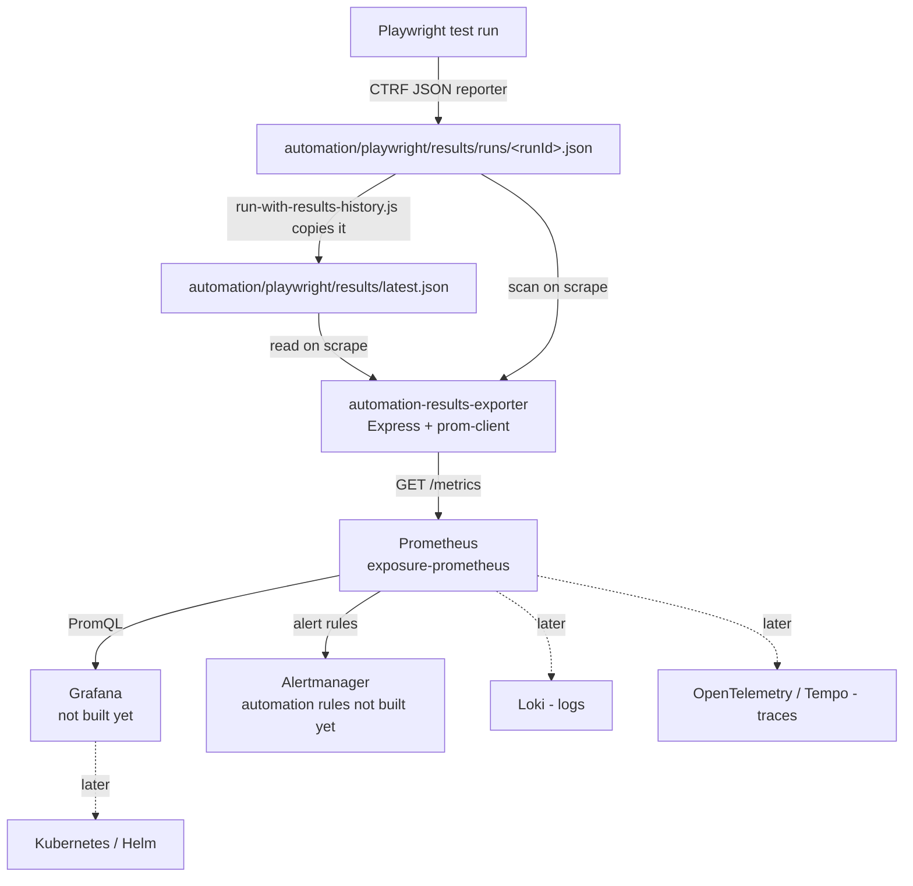

# Playwright → Prometheus Observability — Visual Runbook

Short, visual, operational companion to
[`playwright-prometheus-automation-observability.md`](playwright-prometheus-automation-observability.md).
Keep this one open while you work; read the other one to understand *why*.

---

## 1. One-page mental model

```
Runner writes files.
Exporter reads files.
Prometheus scrapes exporter.
Grafana visualizes Prometheus queries.
```

Nobody pushes anything. Every arrow below is either "write to disk" or
"pull over HTTP on a timer."

---

## 2. Visual architecture diagram



Plain text version:

```
Playwright test run
   -> results/runs/<runId>.json          (written once, immutable)
   -> results/latest.json                (overwritten every run)
        |
        v  (read at scrape time, not on a schedule of its own)
automation-results-exporter (long-running, Express + prom-client)
        |
        v  GET /metrics
Prometheus (long-running, pulls every 1m)
        |
        +--> Grafana        (later)
        +--> Alertmanager   (later, for this exporter's own alert rules)
        +--> Loki           (later)
        +--> OTel / Tempo   (later)
             +--> Kubernetes / Helm (later)
```

---

## 3. File dependency map

```
index.ts
  -> app.ts
  -> config.ts

app.ts
  -> routes/health.routes.ts
  -> routes/metrics.routes.ts

routes/metrics.routes.ts
  -> metrics/update-latest-run.metrics.ts
  -> metrics/update-history.metrics.ts
  -> metrics/registry.ts

routes/health.routes.ts
  -> config.ts

metrics/update-latest-run.metrics.ts
  -> results/ctrf-reader.ts
  -> metrics/automation.metrics.ts
  -> config.ts

metrics/update-history.metrics.ts
  -> results/runs-reader.ts
  -> metrics/automation.metrics.ts
  -> config.ts

results/runs-reader.ts
  -> results/ctrf-reader.ts

metrics/automation.metrics.ts
  -> metrics/registry.ts
```

Read this bottom-up when debugging: if a gauge has the wrong value, the
bug is in `ctrf-reader.ts` or `runs-reader.ts` (the actual file parsing),
not in the route or the registry.

---

## 4. `/metrics` request flow

```mermaid
sequenceDiagram
    participant P as Prometheus
    participant R as metrics.routes.ts
    participant U1 as updateLatestRunMetrics()
    participant U2 as updateHistoryMetrics()
    participant FS as Filesystem
    participant Reg as registry (prom-client)

    P->>R: GET /metrics
    R->>U1: updateLatestRunMetrics()
    U1->>FS: read latest.json
    U1->>Reg: Gauge.set(...) x4
    R->>U2: updateHistoryMetrics()
    U2->>FS: scan runs/*.json
    U2->>Reg: Gauge.set(...) x5
    R->>Reg: registry.metrics()
    Reg-->>R: Prometheus text format
    R-->>P: 200 OK, Content-Type: text/plain; version=0.0.4
```

Plain text version:

```
Prometheus
  -> GET /metrics
  -> metrics.routes.ts
     -> updateLatestRunMetrics()
        -> read results/latest.json (ctrf-reader.ts)
        -> set 4 "last run" Gauges
     -> updateHistoryMetrics()
        -> scan results/runs/*.json (runs-reader.ts, via ctrf-reader.ts per file)
        -> set 5 "history" Gauges
     -> registry.metrics()  -> Prometheus text format
  -> Prometheus receives + stores the scraped samples
```

Nothing is cached between scrapes — this whole chain runs fresh, every
single time `/metrics` is requested.

---

## 5. File-by-file cheat sheet

| File | Responsibility (one line) | If it breaks, check |
|---|---|---|
| `src/config.ts` | Resolves `PORT`/`AUTOMATION_ENV`/`RESULTS_DIR` with defaults | Wrong values in `/ready` output → env vars not reaching the container |
| `src/app.ts` | Builds the Express app, mounts both routers | 404 on `/health` or `/metrics` → a router isn't mounted here |
| `src/index.ts` | Binds the port, logs startup | Container exits immediately → check this file's startup log |
| `src/routes/health.routes.ts` | `/health`, `/ready` | `/ready` shows wrong `resultsDir` → check `RESULTS_DIR` env / volume mount |
| `src/routes/metrics.routes.ts` | `/metrics`, orchestrates both updates + error handling | 500 response → check container logs for the JSON error line this file emits |
| `src/results/ctrf-reader.ts` | Parses one CTRF JSON file | Wrong numbers for the *latest* run → bug is here |
| `src/results/runs-reader.ts` | Aggregates all files under `runs/` | Wrong *historical* totals → bug is here |
| `src/metrics/registry.ts` | Shared prom-client `Registry` | Metrics missing entirely from `/metrics` → check registration here |
| `src/metrics/automation.metrics.ts` | Defines all 9 Gauges + labels | Wrong metric name/labels in Grafana/PromQL → check definitions here |
| `src/metrics/update-latest-run.metrics.ts` | Pushes `latest.json` data into Gauges | `automation_last_run_*` stuck/stale → check this file's `.set()` calls |
| `src/metrics/update-history.metrics.ts` | Pushes aggregated history into Gauges | `automation_history_*` stuck/stale → check this file's `.set()` calls |
| `Dockerfile` | Builds the exporter image | Build fails → check build **context** (must be repo root, not app folder) |
| `docker-compose-monitoring.yml` | Runs exporter + Prometheus + Alertmanager + node-exporter + cadvisor | Container won't start / wrong port / wrong mount → check this file |
| `monitoring/prometheus/prometheus.yml` | Scrape config | Target `DOWN` or missing → check job + restart Prometheus (config isn't hot-reloaded) |

---

## 6. Metrics cheat sheet

| Metric | Meaning | Labels | Useful PromQL |
|---|---|---|---|
| `automation_last_run_tests` | Test count, latest run | `environment`, `status` | `automation_last_run_tests{status="failed"}` |
| `automation_last_run_duration_seconds` | Duration, latest run | `environment` | `automation_last_run_duration_seconds` |
| `automation_last_run_status` | 1/0 state, latest run | `environment`, `status` (`passed\|failed\|missing`) | `automation_last_run_status{status="failed"} == 1` |
| `automation_last_run_timestamp_seconds` | Unix time latest run completed | `environment` | `time() - automation_last_run_timestamp_seconds` |
| `automation_history_runs` | Run count, all time | `environment`, `status` (`total\|passed\|failed\|other`) | `automation_history_runs{status="failed"} / automation_history_runs{status="total"}` |
| `automation_history_tests` | Test count, all time | `environment`, `status` | `automation_history_tests{status="failed"}` |
| `automation_history_run_duration_seconds_sum` | Sum of all run durations | `environment` | paired with `_count` below |
| `automation_history_run_duration_seconds_count` | Count of runs with duration data | `environment` | `..._sum / ..._count` = average duration |
| `automation_history_parse_errors` | Unparsable run files | `environment` | `automation_history_parse_errors > 0` |
| `up` | Is the exporter reachable | `job="automation-results-exporter"` | `up{job="automation-results-exporter"}` |

---

## 7. Docker Compose cheat sheet

```yaml
automation-results-exporter:
  build:
    context: .                                             # repo root — not the app folder
    dockerfile: apps/automation-results-exporter/Dockerfile
  ports:
    - "3001:3001"                                           # host access only — irrelevant to Prometheus
  environment:
    RESULTS_DIR: /app/results                                # container-side path
  volumes:
    - ./automation/playwright/results:/app/results:ro        # host results -> container, read-only
  networks:
    - monitoring                                             # required so Prometheus can resolve it
```

- Host path (left of `:`) → your machine. Container path (right of `:`) →
  what `RESULTS_DIR` must match.
- `:ro` = exporter can never write into your results directory.
- Same `networks:` entry as Prometheus is what makes the hostname
  `automation-results-exporter` resolvable — not the `ports:` mapping.

---

## 8. Prometheus cheat sheet

- Config file: `monitoring/prometheus/prometheus.yml`
- Scrape job:
  ```yaml
  - job_name: automation-results-exporter
    metrics_path: /metrics
    static_configs:
      - targets: [automation-results-exporter:3001]
  ```
- Targets UI: http://localhost:9090/targets
- Query UI: http://localhost:9090/graph
- Query API:
  ```bash
  curl -s --get http://localhost:9090/api/v1/query --data-urlencode 'query=up' | jq
  ```
- **Config changes need a restart**: `docker restart exposure-prometheus`
  (no hot-reload on a bind-mounted config file).

---

## 9. CI/CD cheat sheet

```
GitHub Actions / Jenkins run Playwright  ──►  publish results (artifact / S3 / shared volume)
                                                        │
                                                        ▼
                            automation-results-exporter (stays running, separately, always)
```

- Neither GitHub Actions nor Jenkins config exists in this repo yet — §13/§14
  of the main guide give recommended skeletons.
- The one rule that matters: **the exporter is not part of the CI job.**
  It's a long-running service somewhere else, reading wherever CI results
  end up.

---

## 10. Troubleshooting table

| Symptom | Likely cause | Check |
|---|---|---|
| `/metrics` returns 500 | Exception while reading/parsing a file | Container logs — `metrics.routes.ts` logs a structured JSON error with the message |
| `latest.json` missing | No test run has completed yet, or wrong `RESULTS_DIR` | Run `npm run test:observed`; check `/ready` output for the resolved path |
| `runs/` folder missing | Same as above — it's created by `run-with-results-history.js` on first run | `fs.mkdirSync(runsDir, { recursive: true })` runs at script start — confirm the script actually ran |
| Prometheus target `DOWN` | Wrong hostname/port, missing network, container not running | See main guide §10 debug steps 1-5 |
| PromQL query returns no data | Metric name typo, target never scraped successfully, or Prometheus needs a restart after config change | Check `/targets` health first, then the exact metric name in `automation.metrics.ts` |
| Wrong Docker volume | Host/container path mismatch | Compare `volumes:` left side (host) vs `RESULTS_DIR` (container side) — they must agree |
| Wrong `RESULTS_DIR` | Env var doesn't match the actual mount target | `/ready` echoes the resolved `resultsDir` — trust that over assumptions |
| TypeScript build fails | Missing file, wrong import name, or empty `package.json`/`tsconfig.json` | Run `npm run build` locally first, before touching Docker at all |
| Docker build fails with "Missing script: build" | Build context points at repo root but `COPY package*.json` grabbed the wrong file, or vice versa | Confirm `context:` in Compose matches what the Dockerfile's `COPY` paths assume |
| Jenkins/GitHub artifacts missing | `archiveArtifacts`/`upload-artifact` step missing `if: always()` or wrong path | Ensure results are published even when tests fail |
| CTRF overwrites report instead of creating history | Reporter pointed directly at a fixed filename instead of `runs/<runId>.json` | Confirm `playwright.config.ts`'s CTRF `outputFile` still uses `automationRunId`, and that `run-with-results-history.js` (not raw `playwright test`) is what's actually being run |

---

## 11. Final compact checklist

```
[ ] Playwright creates CTRF JSON            (playwright.config.ts reporter)
[ ] run-with-results-history updates latest.json
[ ] runs/*.json contains historical runs
[ ] exporter builds successfully            (npm run build, apps/automation-results-exporter)
[ ] /health works
[ ] /ready works                            (and shows the RIGHT resultsDir)
[ ] /metrics exposes automation_* metrics
[ ] Docker Compose runs the exporter        (docker-compose-monitoring.yml)
[ ] Prometheus target is UP                 (http://localhost:9090/targets)
[ ] PromQL returns automation metrics       (see §6 above)
[ ] ready for Grafana dashboard phase
```
